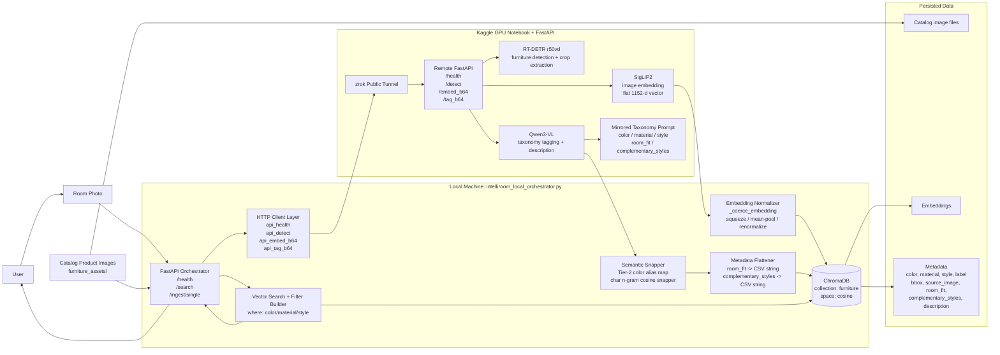
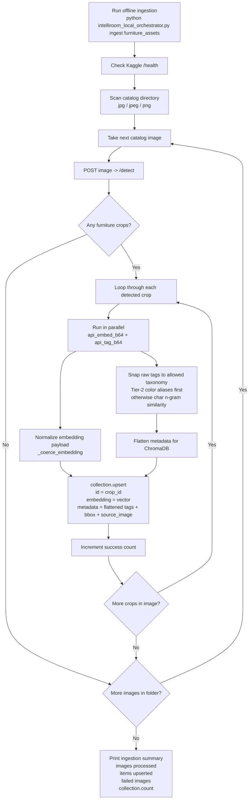
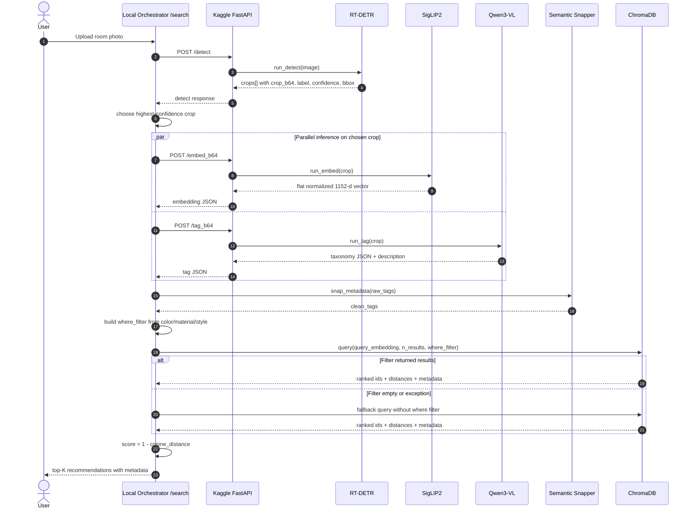
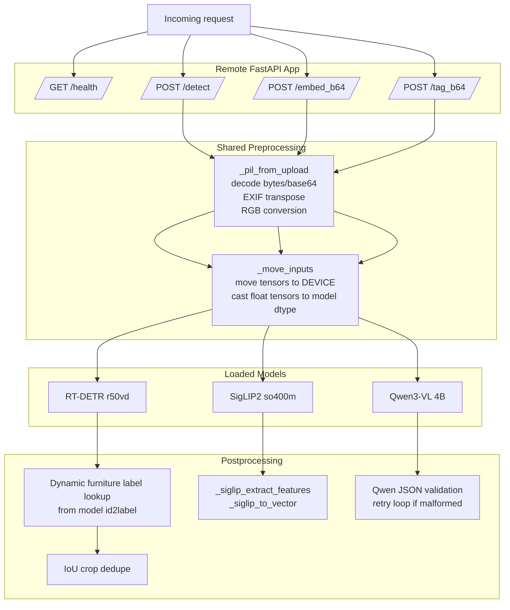
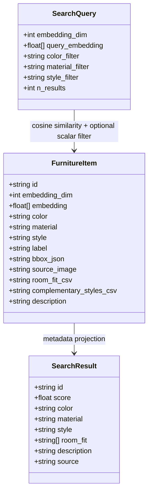
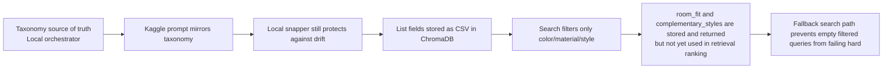

# IntelliRoom Detailed System Diagram

This document reflects the current implementation, not an older idealized design.

Key implementation facts captured below:
- The Kaggle notebook is the GPU inference backend.
- The local orchestrator is the control plane, taxonomy snapper, ChromaDB writer/query layer, and FastAPI app.
- The taxonomy source of truth now lives inside `intelliroom_local_orchestrator.py`, and the Kaggle prompt mirrors it.
- ChromaDB stores flattened metadata, with list fields saved as comma-separated strings.
- Search currently filters on `color`, `material`, and `style`, then falls back to pure vector search if the filtered query returns nothing.

## 1. End-to-End Architecture

## 2. Offline Ingestion Pipeline

## 3. Online Search Pipeline

## 4. Kaggle Inference Backend Internals

## 5. ChromaDB Item Shape

## 6. Current Behavioral Notes

