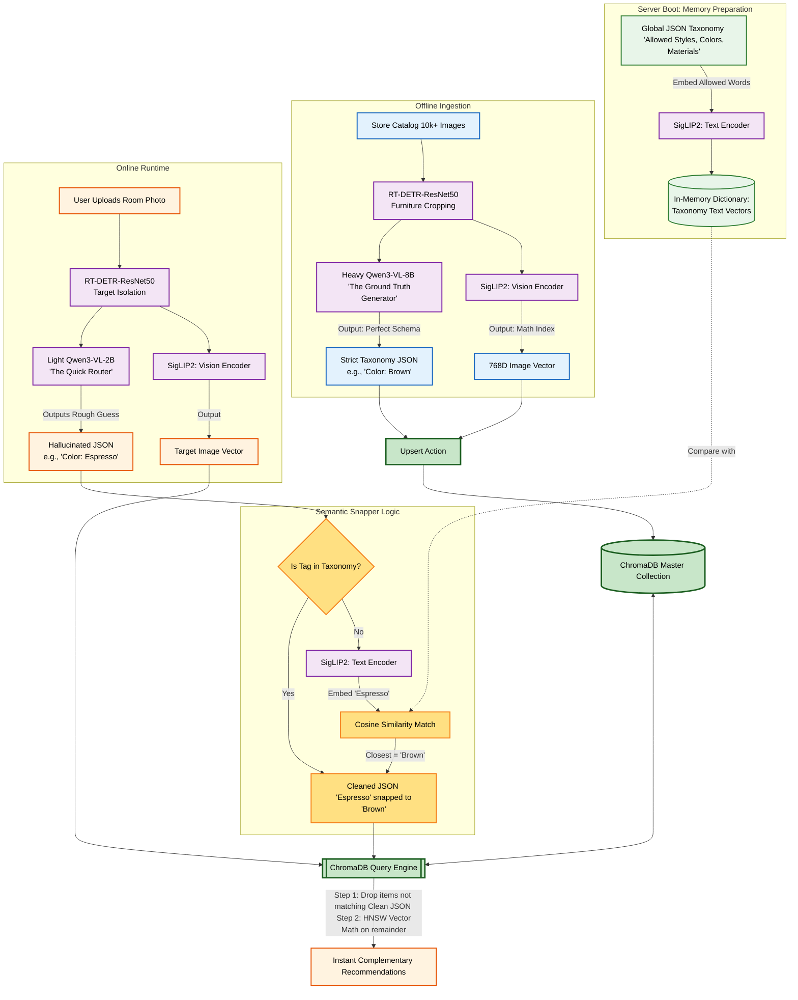

```mermaid
graph TD
    classDef offline fill:#e3f2fd,stroke:#1565c0,stroke-width:2px,color:#000;
    classDef online fill:#fff3e0,stroke:#e65100,stroke-width:2px,color:#000;
    classDef models fill:#f3e5f5,stroke:#7b1fa2,stroke-width:2px,color:#000;
    classDef memory fill:#e8f5e9,stroke:#2e7d32,stroke-width:2px,color:#000;
    classDef db fill:#c8e6c9,stroke:#1b5e20,stroke-width:3px,color:#000;
    classDef logic fill:#ffe082,stroke:#f57f17,stroke-width:2px,color:#000;

    subgraph Server_Startup[Server Boot: Memory Preparation]
        S1[Global JSON Taxonomy <br> 'Allowed Styles, Colors, Materials']:::memory
        S2[SigLIP2: Text Encoder]:::models
        S3[(In-Memory Dictionary: <br> Taxonomy Text Vectors)]:::memory
        S1 -->|Embed Allowed Words| S2 --> S3
    end

    subgraph Admin_Pipeline[Offline Ingestion]
        A1[Store Catalog 10k+ Images]:::offline --> A2[RT-DETR-ResNet50 <br> Furniture Cropping]:::models
        A2 --> A3_Vision[SigLIP2: Vision Encoder]:::models
        A2 --> A3_VLM[Heavy Qwen3-VL-8B <br> 'The Ground Truth Generator']:::models
        A3_Vision -->|Output: Math Index| A4_Vector[768D Image Vector]:::offline
        A3_VLM -->|Output: Perfect Schema| A4_JSON[Strict Taxonomy JSON <br> e.g., 'Color: Brown']:::offline
    end

    A4_Vector --> DB_Upsert
    A4_JSON --> DB_Upsert
    DB_Upsert[Upsert Action]:::db --> ChromaDB[(ChromaDB Master Collection)]:::db

    subgraph User_Pipeline[Online Runtime]
        U1[User Uploads Room Photo]:::online --> U2[RT-DETR-ResNet50 <br> Target Isolation]:::models
        U2 --> U3_Vision[SigLIP2: Vision Encoder]:::models
        U2 --> U3_VLM[Light Qwen3-VL-2B <br> 'The Quick Router']:::models
        U3_Vision -->|Output| U4_Vector[Target Image Vector]:::online
        U3_VLM -->|Outputs Rough Guess| U4_JSON[Hallucinated JSON <br> e.g., 'Color: Espresso']:::online
    end

    subgraph Semantic_Mapper[Semantic Snapper Logic]
        M1{Is Tag in Taxonomy?}:::logic
        M2[SigLIP2: Text Encoder]:::models
        M3[Cosine Similarity Match]:::logic
        M4[Cleaned JSON <br> 'Espresso' snapped to 'Brown']:::logic
        U4_JSON --> M1
        M1 -->|No| M2 -->|Embed 'Espresso'| M3
        S3 -.->|Compare with| M3
        M3 -->|Closest = 'Brown'| M4
        M1 -->|Yes| M4
    end

    Query_Engine[[ChromaDB Query Engine]]:::db

    U4_Vector --> Query_Engine
    M4 --> Query_Engine
    ChromaDB <--> Query_Engine
    Query_Engine -->|Step 1: Drop items not matching Clean JSON <br> Step 2: HNSW Vector Math on remainder| Final_Output[Instant Complementary Recommendations]:::online

    Server_Startup ~~~ Admin_Pipeline
    Admin_Pipeline ~~~ User_Pipeline
```