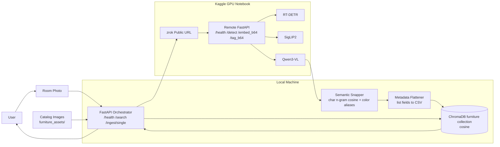
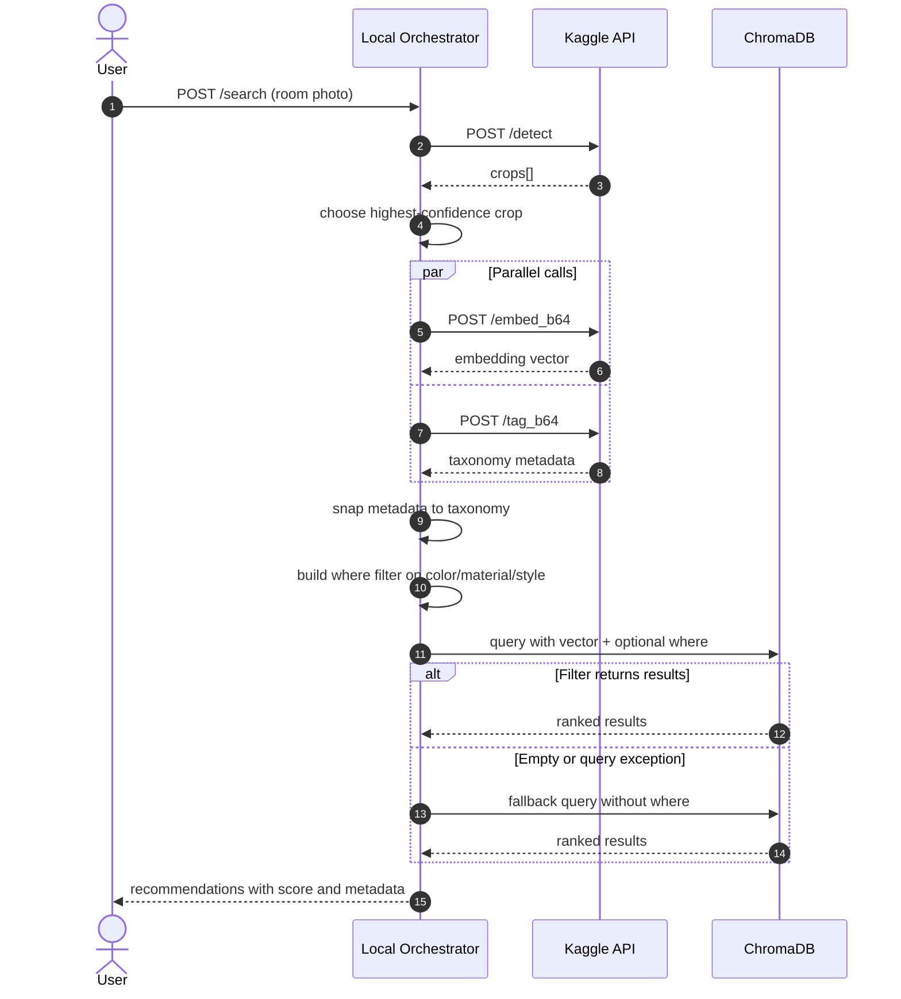

The project uses a two-plane architecture:
- Local control plane: FastAPI orchestrator, taxonomy snapper, and ChromaDB retrieval
- Remote inference plane: Kaggle GPU notebook serving detection, embedding, and tagging APIs through zrok

## Table of Contents

- [Overview](#overview)
- [Architecture](#architecture)
- [Repository Layout](#repository-layout)
- [Requirements](#requirements)
- [Quick Start](#quick-start)
- [Offline Ingestion](#offline-ingestion)
- [Online Search](#online-search)
- [API Reference](#api-reference)
- [Data Model](#data-model)
- [Operational Notes](#operational-notes)
- [Troubleshooting](#troubleshooting)

## Overview

Core capabilities:
- Detect furniture regions from a full room image using RT-DETR
- Compute visual embeddings using SigLIP2
- Generate taxonomy-constrained metadata using Qwen3-VL
- Snap noisy tags to the allowed taxonomy using a local semantic snapper
- Store vectors and flattened metadata in ChromaDB
- Retrieve recommendations with scalar filtering and vector fallback

Current implementation traits:
- Taxonomy source of truth is in the local orchestrator
- Kaggle prompt mirrors the same taxonomy
- Embeddings are normalized and stored in a cosine-space Chroma collection
- List metadata is stored as comma-separated strings due to Chroma scalar metadata constraints

## Architecture

### End-to-End System



### Online Search Sequence



## Repository Layout

```text
.
├── intelliroom_local_orchestrator.py  # local API, ingestion, snapper, retrieval
├── kaggle_nb.ipynb                    # Kaggle GPU backend and zrok tunnel
├── furniture_assets/                  # catalog images for ingestion
├── chromadb/                          # local vector DB (runtime data)
├── Detailed System Diagram.md         # implementation-accurate design doc
├── Feature Diagram.md                 # older conceptual diagram
├── pyproject.toml
└── uv.lock
```

## Requirements

- Python 3.12+
- One of:
  - uv
  - pip
- Kaggle notebook runtime with GPU access
- zrok token configured in Kaggle secrets as ZROK_TOKEN

Local Python dependencies are declared in pyproject.toml:
- chromadb
- fastapi
- httpx
- numpy
- pillow
- python-multipart
- uvicorn

## Quick Start

### 1) Install Dependencies

Using uv:

```bash
uv sync
```

Using pip:

```bash
python -m venv .venv
source .venv/bin/activate
pip install -U pip
pip install -e .
```

### 2) Start Kaggle Backend

Open kaggle_nb.ipynb and run cells in order:
1. Install packages
2. Load models
3. Start FastAPI server in background thread
4. Start zrok share command (keep the cell running)

Copy the public zrok URL.

### 3) Configure Local Orchestrator

```bash
export KAGGLE_BASE_URL="https://your-zrok-url"
```

### 4) Run Local API

```bash
python intelliroom_local_orchestrator.py
```

Expected local endpoints:
- http://localhost:7860/health
- http://localhost:7860/docs

## Offline Ingestion

Ingest full catalog folder:

```bash
python intelliroom_local_orchestrator.py ingest furniture_assets
```

Default catalog path in code is ./catalog_images when no folder is provided.

Incremental ingestion via API:

```bash
curl -X POST "http://localhost:7860/ingest/single" \
  -F "image=@furniture_assets/ComfyUI_00007_(1).png"
```

## Online Search

Search with a room photo:

```bash
curl -X POST "http://localhost:7860/search" \
  -F "photo=@path/to/room_photo.jpg"
```

Response includes:
- id
- score (1 - cosine distance)
- color, material, style
- room_fit
- description
- source image filename

## API Reference

### Local Orchestrator (port 7860)

| Endpoint | Method | Purpose |
|---|---|---|
| /health | GET | Local and remote health + Chroma item count |
| /search | POST | Room photo to recommendations |
| /ingest/single | POST | Ingest one catalog image |

### Kaggle Backend (port 8000, exposed through zrok)

| Endpoint | Method | Purpose |
|---|---|---|
| /health | GET | Model and device status |
| /detect | POST | Furniture crop extraction |
| /embed_b64 | POST | Embedding for base64 crop |
| /tag_b64 | POST | Taxonomy metadata for base64 crop |
| /embed | POST | Embedding for uploaded file |
| /tag | POST | Taxonomy metadata for uploaded file |

## Data Model

Stored metadata keys in Chroma:
- color
- material
- style
- label
- bbox
- source_image
- room_fit
- complementary_styles
- description

Notes:
- room_fit and complementary_styles are persisted as comma-separated strings
- Retrieval filtering currently uses only color, material, style
- room_fit and complementary_styles are returned but not used in ranking

## Operational Notes

- Chroma collection name: furniture
- Similarity space: cosine
- Search top-k default: 10
- Orchestrator detect threshold default: 0.5
- Kaggle detect endpoint default: 0.35
- Embedding dimension currently observed in local collection: 1152

## Troubleshooting

Common issues:

1. Kaggle unreachable from local orchestrator
   - Confirm zrok share cell is still running
   - Export correct KAGGLE_BASE_URL
   - Check /health on both local and remote endpoints

2. Qwen tagging returns 422
   - This means JSON validation failed after retries
   - Retry request or use a clearer crop image

3. Empty result set after metadata filtering
   - The local search path already falls back to pure vector query
   - Inspect returned tags and verify catalog coverage

4. Slow ingestion throughput
   - Verify Kaggle runtime has GPU enabled
   - Check for zrok tunnel instability

## Related Documents

- Detailed System Diagram.md
- Feature Diagram.md

